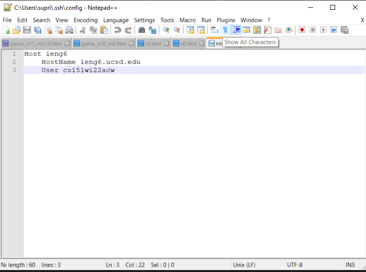
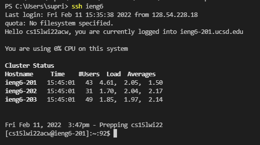
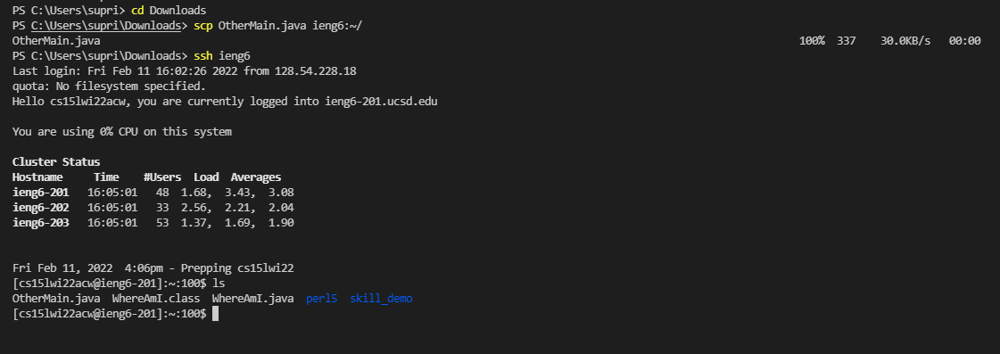

# Lab report 3 - Streamlining SSH Configuration

## Creating the `config` file

* I created this file on my computer and edited on Notepad as shown below, choosing the alias `ieng6`.

## Logging in with the alias

* Here is a screenshot of logging in to the server using the shortcut with my alias.

## Copying a file into the server using the alias

* Earlier (in lab report 2) we used the command `scp fileName.java cs15lwi22zz@ieng6.ucsd.edu` to copy a file from the client to the server. Using the alias, this command becomes simpler as I tried to copy a different file to the server in the screenshot below. We can confirm this by listing the files in the server.

