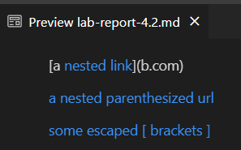
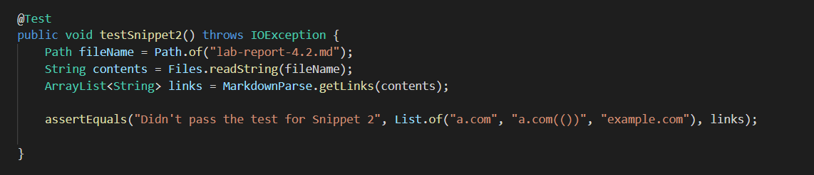
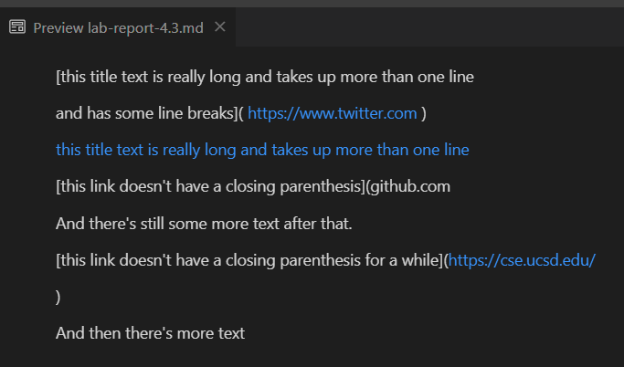

# Lab Report 4

My `markdown-parse` [repository](https://github.com/suprithk/markdown-parse.git)

Reviewed `markdown-parse` [repository](https://github.com/ericwpei/markdown-parse.git)

## Code Snippet 1

This is the preview for the first snippet

* This indicates that the expected links should be 
    * **[`google.com, google.com, ucsd.edu]**

* The test that was included for both the implementations

* My test fails (output shown below)

* The other group's implementation also failed, giving the same output as mine.

* I think there is a small code change that handles the cases of backticks like in the examples from Snippet 1. I could include `if` statements to check if there is an open backtick before the nextOpenBracket and a close backtick in between the nextOpenBracket and nextCloseBracket, or there is an open backtick after the nextOpenBracket and a closing backtick after the nextCloseBracket. In other words if there is one backtick within the brackets and one outside, we shoudn't consider the link. In these case we would have to change currentIndex to the index after close backtick + 1.

## Code Snippet 2

This is the preview for the second snippet

* This indicates that the expected links should be 
    * **[a.com, a.com(()), example.com]**

* The test that was included for both the implementations

* My test fails (output shown below)

* The other group's implementation passed this time, as we added a test but the only fail was for Snippet 1.

* To solve this issue of nested parentheses or brackets, it would take a more involved change as I would have to go over the text inside the brackets/parenthesis to check for another opening bracket or parenthesis and use a counter or a stack to check for each layer being closed inside and then get the last and correct close Parenthesis.

## Code Snippet 3

This is the preview for the third snippet

* This indicates that the expected links should be the following if we want to get all the links in the snippet
    * **["https://www.twitter.com", "https://ucsd-cse15l-w22.github.io/", "https://cse.ucsd.edu/"]**
    * It is also worth considering how we intend to implement our parser. If we just want to include the links that come within the format for links in `md` files, instead of recognizing standalone URLs, we would expect a different output `["https://ucsd-cse15l-w22.github.io/"]`. The other links that show up in the preview are blue only because VSC recognizes them as standalone URLs (we can still see that it prints the brackets and the text within instead of hyperlinking the URL with that text).

* The test that was included for both the implementations

* My test fails (output shown below)

* The other group's implementation also failed, but they had a different output than mine. They got a `StringIndexOutOfBoundsException` where as I just had a different output than expected.

* I think there is a small code change we could implement to work with snippets that have newlines or even spaces within brackets or parenthesis. We could use `String.trim()` to get the text ignoring the spaces and use the `String.contains(String s)` method to check if it has the newline character `"\n"`. According to the preview, if we expect only the links that are within the format, we need to check if there is a newline character within the brackets and ignore the links that are meant to be within their corresponding parenthesis, as the rules require that the text within brackets could be longer than one line, but must not have a newline character within it.
