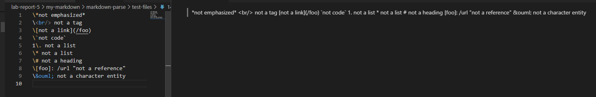
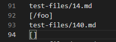
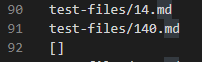
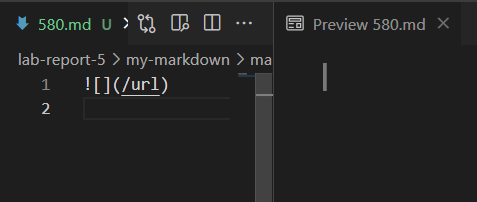
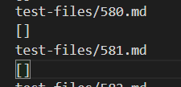
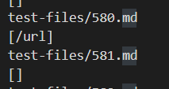

# Lab Report 5

## How I found the tests

* First, I redirected the output from running the `bash script` into a text file, for both the implementations. Then, I compared the results of the two using `diff`.

## Test 1 (14.md)
* The expected output for this file is supposed to be `[]`, as we can see from the VS Code preview of the `.md` file.

* The implementation provided by Lab 9 was incorrect as shown below. It printed `/foo` as one of the links even though it wasn't supposed to.

* My implementation also failed. My algorithm didn't end up returning an any list when it was supposed to.

* For the first implementation (that was provided) we could simply check for the presence of the `"\"` character before the opening bracket, as it escapes the special character after it according to markdown rules. This means `"\["` doesn't count the `"["` as an opening bracket for a link, but instead just prints it as a normal character. This simple change should get the intended output.

## Test 2 (580.md)

* The expected output for this file should be the empty list `[]`. The `.md` file preview is shown below. The format is that of an image. 

* My implementation is giving the intended output, as the parser shouldn't include image links although they have a similar format to regular website links in markdown.

* The implementation provided by Lab 9 is incorrect. It is printing what is supposed to be an image link.

* Although this is a different bug than the one above, it too has a simple fix. The given implementation can include an `if` statement to check for the presence of a `"!"` character before the open bracket. If that condition is true, we skip this line and update index to `closeParen + 1`.

