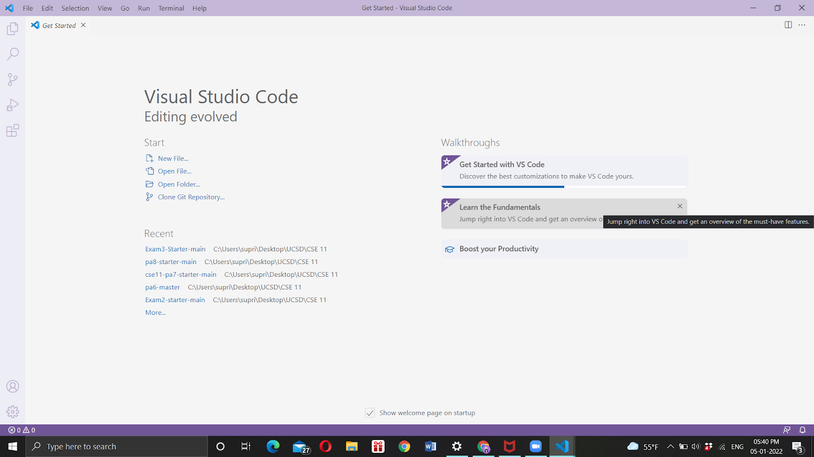
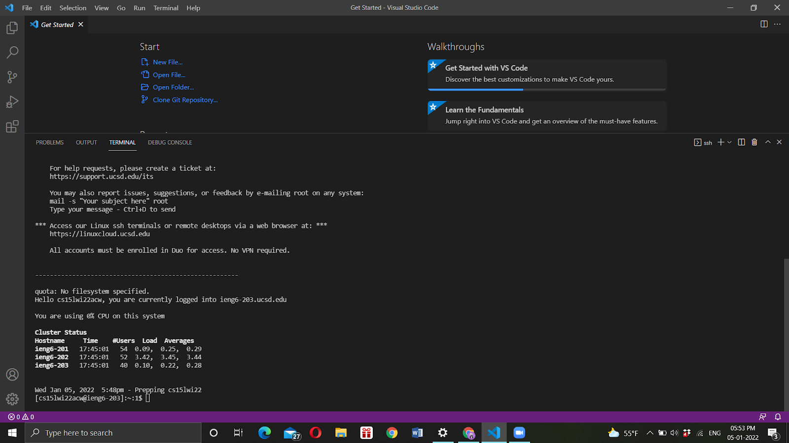
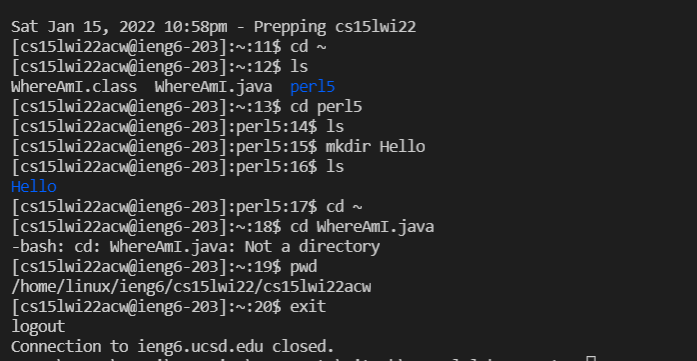
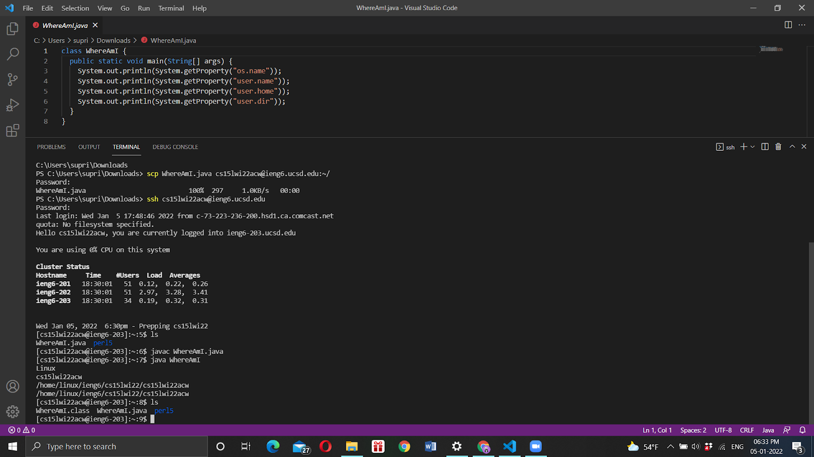
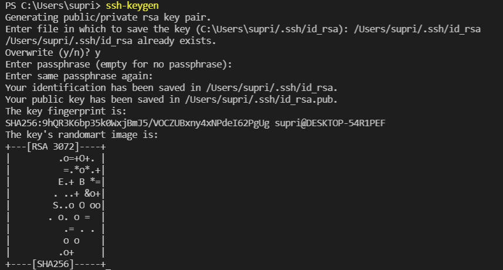
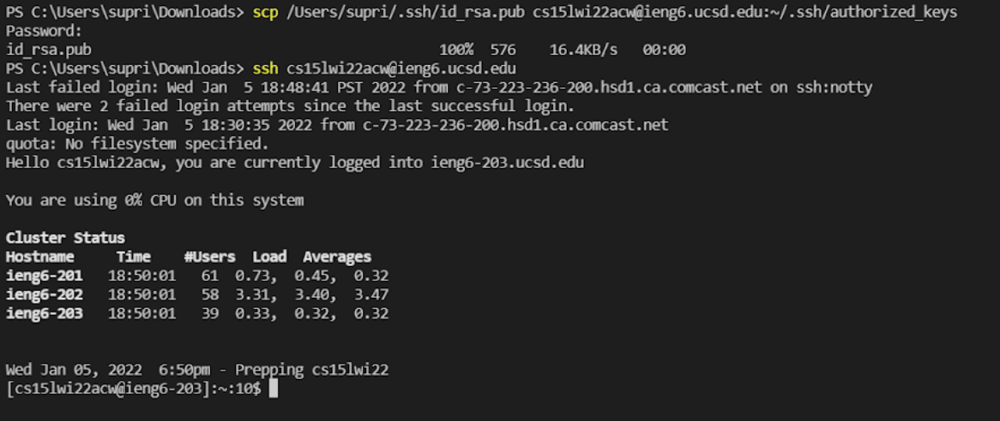
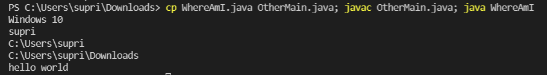

# Installing VScode

To install [Visual Studio Code](https://code.visualstudio.com/), follow the instuction on the website to download the program for your OS (Windows, MacOS, or Linux). Run the executable file and follow the directions prompted. After the installation, opening the application should look like the below screenshot.

# Remotely Connecting

Install [OpenSSH](https://docs.microsoft.com/en-us/windows-server/administration/openssh/openssh_install_firstuse), a program that lets you connect to other remote systems running it. Run the following commands in a terminal in VScode:

 `ssh cs15lwi22xxx@ieng6.ucsd.edu` 
 
 where `xxx` is replaced by your [course-specific account](https://sdacs.ucsd.edu/~icc/index.php). New users might require a confirmation to connect (say yes). Enter your password. It must look like this image.

 

# Trying Some Commands

Here are some useful commands to try in the terminal:

* `cd` - change directory
* `cd ~` - where `~` takes you to the home directory
* `pwd` - print working directory
* `ls` - list files/folders
* `mkdir` - make directory
* `exit` - logout (even Ctrl + D works)

Here is a screenshot for reference. 

# Moving files with `scp`

`scp` is a command that can be run from the client (your computer, not logged into ieng6) and can be used to copy a file to a remote computer (server). After creating a Java file called `WhereAmI.java`, run the following command in the terminal with your username.

`scp WhereAmI.java cs15wi22xxx@ieng6.ucsd.edu:~/`

Enter your password when prompted. Then, log into ssh again as you did in the second step. You should find the file when you type the `ls` command.

# Setting an SSH key

Using `ssh` keys remove the need to login every time, by using a public and private key to communicate between the client and server. Copying the public key to a location on the server, you can use a private key stored in the client device instead of the password. Follow the steps as shown in the image to generate and store the keys.

Follow the command as below and you would be able to login without entering your password.

# Optimizing Remote Running

Learning from above, we can maximize efficiency and use the below methods. 

* `ssh cs15lwi22xxx@ieng6.ucsd.edu "ls"` - you can combine multiple commands in a line. Another example in the screenshot below. 

* A shortcut - use the up-arrow key to recall the last command. 

* To make a local change in `WhereAmI.java` and copy it to the remote server, first add a line to the file on your device:

`System.out.println("hello world");`

Then execute the following in the terminal:

`scp WhereAmI.java cse15lwi22xxx@ieng6.ucsd.edu:~/; javac WhereAmI.java; java WhereAmI`

