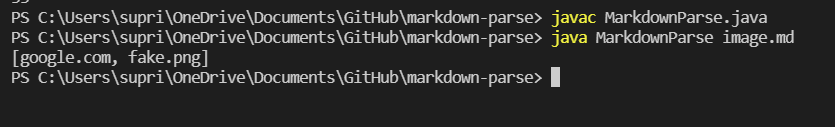
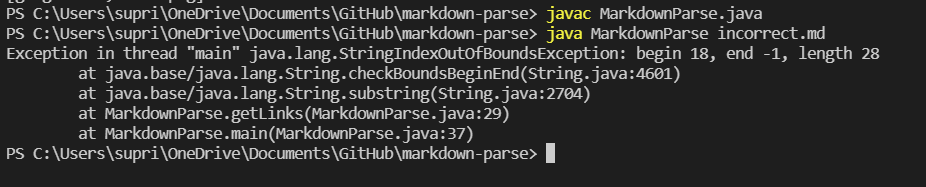
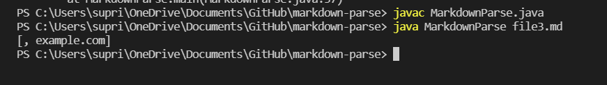

# Bug 1 - File with Image

This [failure-inducing input](https://raw.githubusercontent.com/suprithk/markdown-parse/51f10558fe3f0544eab268874062085a955e7298/image.md) file had an image link along with a website link. 

 The symptom can be seen below as it prints `fake.png` as one the links in the file, although it is an image that is not intended to be printed.

 **Description**: The md file format for links and images are very similar (except that the Image format has a `"!"` before), and the algorithm before didn't have a mechanism to differentiate between the two (the bug). Since it didn't check for the `"!"` sign, it considered Images also a part of the web links in the file, and printed the image links along with regular web links that we actually want (the symptom). The following code change screenshot shows the changes made that detects a `"!"` so that an image link isn't incorrectly included in the list of links.

# Bug 2 - File with Incorrect Format 

This [failure-inducing input](https://raw.githubusercontent.com/suprithk/markdown-parse/51f10558fe3f0544eab268874062085a955e7298/incorrect.md) had a link with incorrect format as it lacked a closing parenthesis after the link. 

The symptom can be seen below as we get a `java.lang.StringIndexOutofBoundsException`. 

**Description:** This was because the algorithm couldn't find the index of the closing parenthesis. The output reports that at line 29 in the getLinks method (which tries to add the substring between the open parenthesis and closed parenthsis), it failed to find the index of the closing parenthesis (indicated by end -1). The next image then shows the changes that were made and commited to fix this issue. We now check of there isn't a closing parenthesis `"("` and exit with printing all the links until then as a fix.

# Bug 3 - File with Empty Parenthesis

This [failure-inducing input](https://raw.githubusercontent.com/suprithk/markdown-parse/b5b3286e691f36652e65c849355618a38ab788ad/file3.md) had the line `` that made the algorithm add an additional empty element to the array.

It produced the symptom `[, example.com]` as can be seen below. 

**Description:** The original program always assumed that there would be an actual link between the parenthesis. In the case that there was just empty parenthesis `()`, it would add an empty string element to the array of links, which would be outputted. The algorithm was changed as shown below to skip this empty element instead.

