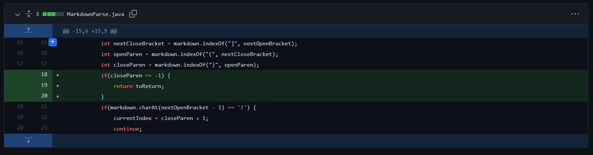

# Bug 1 - File with Image

This [failure-inducing input](https://raw.githubusercontent.com/suprithk/markdown-parse/51f10558fe3f0544eab268874062085a955e7298/image.md) file had an image link along with a website link. The algorithm didn't have a mechanism to differentiate between the two as they both have very similar formats. The symptom was the output of the list `[google.com, fake.png]`. The following code change screenshot shows the changes made that detects a `!` so that an image link isn't incorrectly included in the list of links.

# Bug 2 - File with Incorrect Format 

This [failure-inducing input](https://raw.githubusercontent.com/suprithk/markdown-parse/51f10558fe3f0544eab268874062085a955e7298/incorrect.md) had a link with incorrect format as it lacked a closing parenthesis after the link. The following screenshot shows the error message (the symptom), which was the IndexOutOfBoundsException. This was because the algorithm couldn't find the index of the closing parenthesis. The next image then shows the changes that were made and commited to fix this issue.

# Bug 3 - File with 

This [failure-inducing input](https://raw.githubusercontent.com/suprithk/markdown-parse/b5b3286e691f36652e65c849355618a38ab788ad/file3.md) had the line `` that made the algorithm add an additional empty element to the array producing the symptom `[, example.com]`. The algorithm was changed as shown below to skip this empty element instead.

